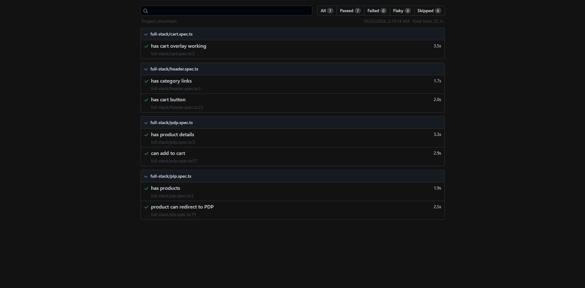

# Scandiweb Test Task - E-commerce Frontend

A test task implementation for Scandiweb featuring a single-page e-commerce application built with React.

## Frontend Features
- React Class Components
- Vite
- GraphQL Integration
- Custom CSS Implementation (No UI Libraries)
- Figma Design Implementation
- Single Page Application (SPA)

## Styling Options Used
- TailwindCSS
- Custom CSS

## Backend Repository
[E-commerce Backend](https://github.com/Ali-Mohamed-Abdelmawla/Ecommerce.git)

## Auto QA test
